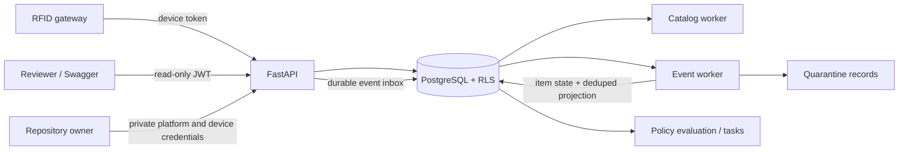

# RFID Inventory and Replenishment Platform

Production-shaped backend for Orange's RFID inventory and replenishment workflow:

`Tenant/Store → Zones/Devices → Catalog/EPCs → RFID → Item State → Inventory → Policy → Task`

The reference API is Python 3.12, FastAPI, SQLAlchemy 2, PostgreSQL 17, Alembic,
JWT, and Pytest. There is intentionally no frontend or external message broker.

## Hosted demo

- API: <https://abacus-take-home-api.onrender.com>
- Swagger: <https://abacus-take-home-api.onrender.com/docs>
- OpenAPI: <https://abacus-take-home-api.onrender.com/openapi.json>
- Readiness: <https://abacus-take-home-api.onrender.com/health/ready>
- Release metadata: <https://abacus-take-home-api.onrender.com/version>

The hosted demo runs release `0.6.1` on Render with PostgreSQL 16. Render may need
about a minute to wake the free web service after inactivity.

Public reviewer login:

| Tenant | Email | Password | Access |
|---|---|---|---|
| `orange` | `demo-reader@orange.example` | `Orange-Demo-ReadOnly-2026!` | Tenant-scoped, read-only |

In Swagger, run `POST /v1/auth/login`, copy the returned `access_token`, select
**Authorize**, and paste it into `HTTPBearer`. Then call `GET /v1/me`, `GET /v1/stores`,
`GET /v1/stores/{store_id}/zones`, `GET /v1/stores/{store_id}/devices`, `GET /v1/skus`,
inventory, policies, tasks, and RFID quarantine. Copy a `store_id` from the store page
for store-scoped calls. A mutation such as `POST /v1/replenishment/evaluations`
returns `403 Forbidden` for this identity.

`GET /` is the authoritative source for the currently configured public login. The
same flow with curl:

```bash
BASE=https://abacus-take-home-api.onrender.com
TOKEN=$(curl -sS -X POST "$BASE/v1/auth/login" \
  -H 'Content-Type: application/json' \
  -d '{"tenant_code":"orange","email":"demo-reader@orange.example","password":"Orange-Demo-ReadOnly-2026!"}' \
  | python -c "import json,sys; print(json.load(sys.stdin)['access_token'])")

curl -sS -H "Authorization: Bearer $TOKEN" "$BASE/v1/me"
curl -sS -H "Authorization: Bearer $TOKEN" "$BASE/v1/stores?limit=5"
curl -sS -H "Authorization: Bearer $TOKEN" "$BASE/v1/skus?limit=5"

STORE_ID=<copy-an-id-from-the-store-response>
curl -sS -H "Authorization: Bearer $TOKEN" "$BASE/v1/stores/$STORE_ID/zones"
curl -sS -H "Authorization: Bearer $TOKEN" "$BASE/v1/stores/$STORE_ID/devices"
curl -sS -H "Authorization: Bearer $TOKEN" "$BASE/v1/stores/$STORE_ID/inventory?limit=5"
curl -sS -H "Authorization: Bearer $TOKEN" "$BASE/v1/replenishment-policies?limit=5"
curl -sS -H "Authorization: Bearer $TOKEN" "$BASE/v1/stores/$STORE_ID/replenishment-tasks?limit=5"
curl -sS -H "Authorization: Bearer $TOKEN" "$BASE/v1/rfid/quarantine?limit=5"
curl -i -X POST "$BASE/v1/replenishment/evaluations" \
  -H "Authorization: Bearer $TOKEN" -H 'Content-Type: application/json' \
  -d "{\"store_id\":\"$STORE_ID\",\"sku_ids\":[]}"  # expected: 403
```

Or run the full public read-path check with Python 3.12 and no project installation;
the script discovers the current public login from `GET /`:

```bash
python scripts/public_demo_smoke.py
```

The platform key, tenant-admin login, and device credentials stay private. They permit
tenant provisioning, catalog mutation, identity administration, or RFID ingestion and
are not needed to inspect the hosted API. The repository owner can run the full
write-path walkthrough with those credentials through `scripts/run_architecture_demo.py`.

The hosted database is preseeded. Startup intentionally reconciles identities but does
not recreate mutable stores, catalog, or inventory; after attaching a fresh database,
run the private architecture demo once. Locally, `make demo` performs that step.

## Reviewer quick start

Prerequisites: Docker with Compose v2. GNU Make is convenient but not required.

```bash
docker compose up --build
```

In another terminal:

```bash
make seed
make demo
make test
```

The demo prints six end-to-end checks, including duplicate/late RFID protection and
store-level authorization. Swagger is at <http://localhost:8000/docs>; readiness is
at <http://localhost:8000/health/ready>.

Required commands:

| Command | Purpose |
|---|---|
| `docker compose up --build` | Start the API, PostgreSQL, and both workers |
| `make migrate` | Apply Alembic with the migration-owner credential |
| `make seed` | Idempotently create Orange and its demo tenant administrator |
| `make test` | Run unit and PostgreSQL integration tests in an isolated test database |
| `make demo` | Build/start the stack and run the complete end-to-end workflow |

Without Make, run the commands shown in the [Makefile](Makefile) directly. Local
credentials in `docker-compose.yml` are deliberately marked local-only.

## Architecture



The source diagram is [docs/architecture.mmd](docs/architecture.mmd).

The three deployable processes share one image and codebase:

1. FastAPI REST API
2. Catalog/import worker
3. Durable RFID/inventory event worker

PostgreSQL is the system of record and durable work inbox for the hosted deployment.
Parsed catalog rows remain in staging until validation succeeds. Kafka-compatible
streaming and S3 source-file retention are production extensions, not demo dependencies.

## Correctness and failure handling

- Runtime SQL uses `abacus_app`, a `NOSUPERUSER`/`NOBYPASSRLS` role. Alembic alone
  uses the owner credential.
- Runtime connections enforce statement, lock-wait, and idle-transaction timeouts;
  schema migrations use a separate owner connection without those request limits.
- Every tenant transaction sets `app.tenant_id`; forced RLS fails closed when the
  context is absent. Tenant IDs in request bodies are never trusted.
- RLS deliberately enforces the tenant boundary. Store authorization is a separate,
  explicit application boundary: current role and store assignments are loaded from
  PostgreSQL on every request, and collection/resource handlers apply the centralized
  `Principal` scope checks. Tests cover both store denial and corporate tenant-wide
  access. A production deployment that requires database-enforced store scoping could
  add a store-scope session setting, trading a stronger database backstop for more
  complex policies and operational context management.
- Accepted RFID events, retry-batch links, and their durable inbox records commit
  together. A worker outage therefore leaves recoverable work, not a false `202`.
- Raw-event and catalog jobs have bounded retries. Exhausted work reaches a terminal
  status with its error preserved; one poison record cannot block later RFID events.
- `(tenant_id, event_id)` is a durable idempotency boundary. A conflicting reuse is
  rejected; a byte-equivalent retry does not add stable-zone evidence twice.
- Worker processing is at least once. Conditional item-state versions, deterministic
  transition IDs, and unique delta IDs make retries safe; no exactly-once claim is made.
- Item state and its inventory-transition outbox commit in one transaction. The event
  worker deduplicates each delta before updating derived bucket counts.
- Repeated reads throttle `current_item_state` last-seen writes. The immutable event
  ledger provides the durable event-time watermark after a worker restart, so this
  optimization cannot allow a late event to regress state.
- Projection counts are rebuildable from `current_item_state` with
  `abacus-cli rebuild-inventory-projection --tenant-id …`.
- Freshness is derived from heartbeat age, live-event age, backlog drain, and reader
  coverage. It decays without needing another event. Non-live stores cannot trigger
  automatic replenishment or RFID timeout removals.
- Role and store-scope changes are atomic, invalidate existing JWTs, and append an
  audit record. The corresponding migration downgrade deliberately refuses to narrow
  the action constraint after such records exist rather than discard audit history.

## REST API

The authoritative contract is `GET /openapi.json` (OpenAPI 3.1, release `0.6.1`).

The visible contract includes all required endpoints:

- Onboarding: tenants, store imports, scoped store discovery, zones, devices
- Catalog: create import, status, row errors, SKU discovery
- RFID: submit batch, batch status, tenant-wide quarantine inspection
- Inventory: store projection, physical item state
- Identity: create user, atomically replace access, replace roles/store assignments, current user
- Replenishment: policy discovery/version/activation, evaluation, task list/lifecycle
- Operations: liveness, readiness, version

Demo authentication uses a platform key, one-time device credentials, and short-lived
JWTs. JWTs contain only user and tenant identity; current roles and store assignments
are loaded from PostgreSQL on every authenticated request. Production SSO/SCIM is an
explicit extension, not simulated here.

All documented failures use RFC 7807 `application/problem+json`, including validation
and unexpected server errors. Each failure includes the request ID returned in the
`X-Request-ID` response header. The hosted launcher trusts forwarded client addresses
because Render exposes the application port only through its load balancer; local
Compose does not trust arbitrary proxy headers.

Device discovery returns each reader with its currently effective store/zone
assignment. Plaintext device tokens are returned only at registration or rotation.
Store discovery, SKU discovery, inventory, and replenishment-task collections use
bounded `{items, total, limit, offset}` pages. SKU discovery accepts `active=ACTIVE`,
`INACTIVE`, or `ALL`; the previous `true` and `false` values remain supported aliases.

## Catalog and RFID behavior

The sample catalog is [examples/catalog.csv](examples/catalog.csv). Required CSV
columns are `style_code`, `style_name`, `sku`, `upc`, `color`, `size`, and `epc`;
`style_attributes.category` enables category policies. Validation covers formats,
duplicate EPCs, conflicting SKU/UPC mappings, and hierarchy consistency. The checksum
plus idempotency key makes re-import safe.

The durable event record retains the logical partition key `tenant_id:epc`, so a future
Kafka deployment can preserve per-item order without changing the event contract.
Hosted stable-zone defaults are configurable:

- 3 consistent reads from a new zone
- 10-second evidence window
- median-RSSI tie-break across competing observed zones
- previous zone retained with lower confidence when evidence is ambiguous
- 30-minute absence before confirmed removal, only while the store is live
- 30-minute confidence half-life, evaluated at read time without rewriting item rows

Production thresholds require pilot calibration. The confidence half-life and removal
timeout are independently configurable: confidence can suppress automation before a
location is confirmed absent. Recent evidence is intentionally
process-local for this hosted slice. The event ledger and current state are durable;
after a worker restart, new reads rebuild the evidence window while database
watermarks and conditional state updates prevent state regression. The demo uses
gateway reader-coverage status as the reader-health input to confidence; production
integrations would supply per-reader diagnostics and an adjacency graph.

The hosted event worker is intentionally single-instance. Horizontal production
workers require `tenant_id:epc` partition affinity and durable or changelog-backed
evidence windows so all reads for one item reach the same inference state.

## Replenishment

Active policy versions are immutable. Rule precedence is:

1. Store + SKU/size
2. Store + style
3. Store + category
4. Tenant + SKU/size
5. Tenant + style
6. Tenant + category
7. Tenant default

Equal-specificity rules use explicit priority; equal-priority overlaps are rejected.
Policy discovery returns the active version by default (or the latest draft before
first activation for policy managers). Read-only roles see active policy only; policy
managers may use the optional `status` filter for draft or retired versions.
Evaluation is per SKU/size and uses:

```text
if floor_qty >= min_floor_qty:
    required_qty = 0
else:
    required_qty = min(backroom_qty,
                       max(0, target_floor_qty - floor_qty - open_task_qty))
```

A partial unique index permits only one `OPEN`, `CLAIMED`, or `IN_PROGRESS` task per
tenant/store/SKU. The lifecycle is `OPEN → CLAIMED → IN_PROGRESS → COMPLETED`, with
`CANCELED` and `EXPIRED` terminal alternatives.

Quarantined RFID records expose their reason and original payload through
`GET /v1/rfid/quarantine` to tenant-wide inventory readers. A terminal event ID is
never silently reset: after remediation, the operator resubmits the physical
observation with a new event ID so the original idempotency and audit trail remain intact.

## Tests and utilities

```bash
python -m pytest
ruff check .
ruff format --check .
mypy src scripts/run_architecture_demo.py scripts/rfid_simulator.py scripts/smoke_test.py scripts/generate_store_batch.py
```

The suite covers RLS tenant isolation, store/corporate authorization, catalog
idempotency, durable RFID dedupe, late/future events, stable and ambiguous zones,
bounded poison-event handling, outbox transitions, delta dedupe, projection
reconstruction, policy precedence, size curves, active-task uniqueness, and
stale-store suppression.

`scripts/rfid_simulator.py` generates normal, duplicate, conflicting event-ID,
repeated, late/out-of-order, competing-zone, unknown-EPC, outage/replay, and
stationary-burst scenarios.
`scripts/smoke_test.py` is a dependency-free hosted health/contract check. Release
verification can pin the deployed artifact instead of accepting any healthy build:

```bash
python scripts/smoke_test.py --base-url https://abacus-take-home-api.onrender.com --timeout 90 --expected-version 0.6.1 --expected-build-sha <release-sha> --expected-schema-revision a1d4e7b9c203
```

## Hosting

`render.yaml` defines a free-demo web service whose supervised launcher runs the API
and both worker entry points in one container. Docker Compose keeps those processes
separate, which is the production-shaped topology. Hosted deployment needs one
managed PostgreSQL database with two credentials: a migration owner and a non-owner
`abacus_app` runtime role.

Create that role once with the database owner before the first deployment (replace
the password and database name):

```sql
CREATE ROLE abacus_app LOGIN NOSUPERUSER NOCREATEDB NOCREATEROLE NOINHERIT
  NOBYPASSRLS PASSWORD '<random-runtime-password>';
GRANT CONNECT ON DATABASE <database_name> TO abacus_app;
```

Use the owner connection for `MIGRATION_DATABASE_URL` and construct `DATABASE_URL`
with the new `abacus_app` credential. `/health/ready` rejects a production runtime
connection that is not exactly this configured non-superuser, non-`BYPASSRLS` role.

Local Compose is free apart from the host machine. Hosted secrets must be supplied out
of band. Create the application role before the first migration so Alembic can grant
table, sequence, function, and RLS access. The Blueprint references database URLs as
secrets instead of creating a provider-specific database. A free Render web instance
sleeps when idle, so its workers sleep too; use a paid always-on instance for a more
reliable reviewer URL. The free launcher must retain the owner URL to run migrations
at startup because pre-deploy commands are paid-only. A production deployment keeps
that credential out of the runtime container. Kafka/S3 can be added later without
changing the item-state, transition-ID, delta-ID, or projection contracts.

Kubernetes, Flink, regional cells, DynamoDB, enterprise OIDC/SAML/SCIM, X.509 device
lifecycle, precise XY positioning, and real reader integration are documented production
extensions only. They are intentionally outside this implementation's executable scope.
