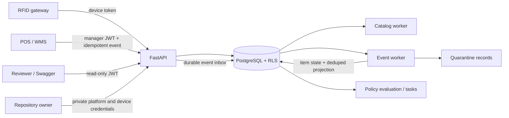

# RFID Inventory and Replenishment Platform

Production-shaped backend for Orange's RFID inventory and replenishment workflow:

`Tenant/Store → Zones/Devices → Catalog/EPCs → RFID → Item State → Inventory → Policy → Task`

The reference API is Python 3.12, FastAPI, SQLAlchemy 2, PostgreSQL, Alembic,
JWT, and Pytest. There is intentionally no frontend or external message broker.

## Hosted demo

- API: <https://abacus-take-home-api.onrender.com>
- Swagger: <https://abacus-take-home-api.onrender.com/docs>
- OpenAPI: <https://abacus-take-home-api.onrender.com/openapi.json>
- Readiness: <https://abacus-take-home-api.onrender.com/health/ready>
- Release metadata: <https://abacus-take-home-api.onrender.com/version>

The hosted demo runs release `0.9.0` on Render with managed PostgreSQL. Render may need
about a minute to wake after inactivity.

Public reviewer login:

| Tenant | Email | Password | Access |
|---|---|---|---|
| `orange` | `demo-reader@orange.example` | `Orange-Demo-ReadOnly-2026!` | Tenant-scoped, read-only |

Demo-only reviewer account with access to synthetic Orange tenant data. All
business-data mutation endpoints are denied. Administrative, device, platform, and
infrastructure credentials are not published.

The hosted reviewer account is read-only. To submit custom test data or exercise
mutation endpoints, run `make demo` locally and use Swagger at
<http://localhost:8000/docs>.

The hosted demo reports `STALE` inventory with decayed confidence between demo runs.
This is the freshness model working: confidence decays on a 30-minute half-life, and
`POST /v1/replenishment/evaluations` refuses any store that is not `LIVE` rather than
generating tasks from untrusted data.

In Swagger, run `POST /v1/auth/login`, copy the returned `access_token`, select
**Authorize**, and paste it into `HTTPBearer`. Then call `GET /v1/me`, `GET /v1/stores`,
`GET /v1/stores/{store_id}/zones`, `GET /v1/stores/{store_id}/devices`, `GET /v1/skus`,
inventory, policies, tasks, and RFID quarantine. Copy a `store_id` from the store page
for store-scoped calls. A mutation such as `POST /v1/replenishment/evaluations`
returns `403 Forbidden` for this identity.

`GET /` is the authoritative source for the currently configured public login. The
same flow with curl:

```bash
BASE=https://abacus-take-home-api.onrender.com
TOKEN=$(curl -sS -X POST "$BASE/v1/auth/login" \
  -H 'Content-Type: application/json' \
  -d '{"tenant_code":"orange","email":"demo-reader@orange.example","password":"Orange-Demo-ReadOnly-2026!"}' \
  | python -c "import json,sys; print(json.load(sys.stdin)['access_token'])")

curl -sS -H "Authorization: Bearer $TOKEN" "$BASE/v1/me"
curl -sS -H "Authorization: Bearer $TOKEN" "$BASE/v1/stores?limit=5"
curl -sS -H "Authorization: Bearer $TOKEN" "$BASE/v1/skus?limit=5"

STORE_ID=<copy-an-id-from-the-store-response>
curl -sS -H "Authorization: Bearer $TOKEN" "$BASE/v1/stores/$STORE_ID/zones"
curl -sS -H "Authorization: Bearer $TOKEN" "$BASE/v1/stores/$STORE_ID/devices"
curl -sS -H "Authorization: Bearer $TOKEN" "$BASE/v1/stores/$STORE_ID/inventory?limit=5"
curl -sS -H "Authorization: Bearer $TOKEN" "$BASE/v1/replenishment-policies?limit=5"
curl -sS -H "Authorization: Bearer $TOKEN" "$BASE/v1/stores/$STORE_ID/replenishment-tasks?limit=5"
curl -sS -H "Authorization: Bearer $TOKEN" "$BASE/v1/rfid/quarantine?limit=5"
curl -i -X POST "$BASE/v1/replenishment/evaluations" \
  -H "Authorization: Bearer $TOKEN" -H 'Content-Type: application/json' \
  -d "{\"store_id\":\"$STORE_ID\",\"sku_ids\":[]}"  # expected: 403
```

Or run the full public read-path check with Python 3.12 and no project installation;
the script discovers the current public login from `GET /`:

```bash
python scripts/public_demo_smoke.py
```

The platform key, tenant-admin login, and device credentials stay private. The platform
key is limited to platform-led tenant/store onboarding; the tenant administrator owns
catalog and identity changes, and device credentials permit RFID ingestion. None are
needed to inspect the hosted API. The repository owner can run the full
write-path walkthrough with those credentials through `scripts/run_architecture_demo.py`.
The public Orange tenant must contain dummy data only: this tenant-wide read-only identity
can inspect its stores, inventory, device metadata, and quarantine payloads.

The hosted database is preseeded. Startup intentionally reconciles identities but does
not recreate mutable stores, catalog, or inventory; after attaching a fresh database,
run the private architecture demo once. Locally, `make demo` performs that step.

## Reviewer quick start

Prerequisites: Docker with Compose v2. GNU Make is convenient but not required.

```bash
make demo
make test
```

The demo converges on the same zones, readers, policy, and identities when rerun. It
ensures the 100-store Orange footprint, imports 100 SKUs, stocks five stores, and prints
eight end-to-end checks. These include duplicate/late RFID protection, RFID verification
of a completed task, store-level authorization, and an idempotent sale. Swagger is at
<http://localhost:8000/docs>; readiness is
at <http://localhost:8000/health/ready>.

For manual local testing, sign in with the local-only Orange administrator configured
in `docker-compose.yml`: tenant `orange`, email `reviewer@orange.example`, password
`OrangeReviewer123!`. Custom catalog CSVs, zones, devices, policies, and other business
data can then be submitted through Swagger. Device registration returns the device token
required by the RFID observation endpoint.

Required commands:

| Command | Purpose |
|---|---|
| `docker compose up --build` | Start the API, PostgreSQL, and both workers |
| `make migrate` | Apply Alembic with the migration-owner credential |
| `make seed` | Idempotently create Orange, its demo administrator, and public read-only reviewer |
| `make test` | Run unit and PostgreSQL integration tests in an isolated test database |
| `make demo` | Build/start the stack and run the complete end-to-end workflow |

Without Make, run the commands shown in the [Makefile](Makefile) directly. Local
credentials in `docker-compose.yml` are deliberately marked local-only.

## Architecture



The source diagram is [docs/architecture.mmd](docs/architecture.mmd).

The three deployable processes share one image and codebase:

1. FastAPI REST API
2. Catalog/import worker
3. Durable RFID/inventory event worker

PostgreSQL is the system of record and durable work inbox for the hosted deployment.
The catalog API atomically stores an immutable source file and durable job, then returns
`202`; the catalog worker performs parsing, conflict validation, staging, and atomic
promotion. The hosted scope retains files up to 10 MiB in PostgreSQL so a worker crash
cannot lose accepted work. Production replaces that byte column with versioned S3
storage while preserving the checksum and job contract. Kafka-compatible streaming is
also a production extension, not a demo dependency.

## Correctness and failure handling

- Runtime SQL uses `abacus_app`, a `NOSUPERUSER`/`NOBYPASSRLS` role. Alembic alone
  uses the owner credential.
- Runtime connections enforce statement, lock-wait, and idle-transaction timeouts;
  schema migrations use a separate owner connection without those request limits.
  Each hosted process uses a bounded `3 + 2` connection pool by default, keeping the
  three-process connection budget at 15 rather than relying on SQLAlchemy defaults.
- Every tenant transaction sets `app.tenant_id`; forced RLS fails closed when the
  context is absent. Tenant IDs in request bodies are never trusted.
- Composite tenant-aware foreign keys bind every child to a parent in the same tenant.
  Store/zone tuples are also constrained together, so a device, observation, item,
  projection, or delta cannot reference a zone from another store.
- Every authenticated transaction also sets an immutable `app.store_scope`. Restrictive
  PostgreSQL policies enforce assigned-store visibility for associates and managers;
  tenant admins and corporate users receive an explicit tenant-wide scope. Application
  permission checks remain the first authorization layer, while RLS is the backstop.
- Accepted RFID events, retry-batch links, and their durable inbox records commit
  together. A worker outage therefore leaves recoverable work, not a false `202`.
- Raw-event and catalog jobs have bounded retries. Exhausted work reaches a terminal
  status with its error preserved; one poison record cannot block later RFID events.
- `(tenant_id, event_id)` is a durable idempotency boundary. A conflicting reuse is
  rejected; a byte-equivalent retry does not add stable-zone evidence twice.
- Worker processing is at least once. Conditional item-state versions, deterministic
  transition IDs, and unique delta IDs make retries safe; no exactly-once claim is made.
- Item state and its inventory-transition outbox commit in one transaction. The event
  worker deduplicates each delta before updating derived bucket counts.
- Projection transitions commit independently. After `WORKER_MAX_ATTEMPTS`, a poison
  transition is retained as quarantined and affected stores report `DEGRADED`, which
  suppresses automatic replenishment. The `abacus-cli rebuild-inventory-projection`
  command reconstructs counts from current item state and closes the reconciliation
  marker.
- Repeated reads throttle `current_item_state` last-seen writes. The immutable event
  ledger provides the durable event-time watermark after a worker restart, so this
  optimization cannot allow a late event to regress state.
- Freshness is derived from heartbeat age, live-event age, backlog drain, and reader
  coverage. It decays without needing another event. RFID silence never decrements
  inventory: an old item becomes `UNOBSERVED`, remains counted, and loses confidence.
  Only an idempotent authoritative sale, transfer-out, or approved removal adjustment
  clears its location and emits `-1` through the same transactional outbox.
- Connectivity writes are serialized per store and ordered by server receipt time, so
  a delayed worker cannot replace newer backlog or reader-coverage status.
- Role and store-scope changes are atomic, invalidate existing JWTs, and append an
  audit record. The runtime role can insert and read that audit trail but cannot update
  or delete it. The corresponding migration downgrade deliberately refuses to narrow
  the action constraint after such records exist rather than discard audit history.
- Access tokens are bound to server-side sessions. Refresh tokens rotate on every use;
  replay revokes the token family, and logout immediately revokes the current session.
- A completed replenishment task remains pending until stable RFID transitions confirm
  the expected backroom-to-floor quantity. Each transition can verify at most one task;
  missing evidence becomes `UNVERIFIED` after the configured window.

## REST API

The authoritative contract is `GET /openapi.json` (OpenAPI 3.1, release `0.9.0`).
It contains 42 paths and 46 operations.

The visible contract includes all required endpoints:

- Onboarding: tenants, store imports, scoped store discovery, zones, devices
- Catalog: create import, status, row errors, SKU discovery
- RFID: submit batch, batch status, tenant-wide quarantine inspection and recovery
- Inventory: store projection, physical item state, authoritative business-event removal
- Identity: login, rotating refresh, logout/revocation, create user, access replacement,
  current user
- Replenishment: policy discovery/version/activation, evaluation, task list/lifecycle
- Operations: liveness, readiness, version

Demo authentication uses a platform key, one-time device credentials, 15-minute
access JWTs, and rotating refresh tokens. JWTs contain user, tenant, and session identity;
current status, roles, store
assignments, and token version are loaded from PostgreSQL on every authenticated
request. Suspension, password rotation, and access changes invalidate existing
tokens immediately. Production SSO remains the enterprise authentication extension.

All documented failures use RFC 7807 `application/problem+json`, including validation
and unexpected server errors. Each failure includes the request ID returned in the
`X-Request-ID` response header. The hosted launcher trusts forwarded client addresses
because Render exposes the application port only through its load balancer; local
Compose does not trust arbitrary proxy headers.

Device discovery returns each reader with its currently effective store/zone
assignment. Plaintext device tokens are returned only at registration or rotation.
Bulk store onboarding records planned hardware mappings without returning hundreds of
secrets in one response; commissioning rotates each device credential before it can
ingest observations.
Store discovery, SKU discovery, inventory, and replenishment-task collections use
bounded `{items, total, limit, offset}` pages. SKU discovery accepts `active=ACTIVE`,
`INACTIVE`, or `ALL`; the previous `true` and `false` values remain supported aliases.

## Catalog and RFID behavior

The sample catalog is [examples/catalog.csv](examples/catalog.csv). Required CSV
columns are `style_code`, `style_name`, `sku`, `upc`, `color`, `size`, and `epc`;
`style_attributes.category` enables category policies. Validation covers formats,
duplicate EPCs, conflicting SKU/UPC mappings, hierarchy consistency, and bounded
finite attribute JSON. The checksum plus idempotency key makes re-import safe.

Effective-dated device assignments and EPC bindings use the PostgreSQL clock. Stable-zone
evidence is clipped at each binding boundary, so reads from an earlier catalog epoch
cannot confirm a replacement SKU.

The durable event record retains the logical partition key `tenant_id:epc`, so a future
Kafka deployment can preserve per-item order without changing the event contract.
Hosted stable-zone defaults are configurable:

- 3 consistent reads from a new zone
- 10-second evidence window
- median-RSSI tie-break across competing observed zones
- previous zone retained with lower confidence when evidence is ambiguous
- 30 minutes without a confirmed read before an item is reported `UNOBSERVED`; it stays counted
- 30-minute confidence half-life, evaluated at read time without rewriting item rows

Production thresholds require pilot calibration. The confidence half-life and
`UNOBSERVED` threshold are independently configurable; neither changes quantity.

An upgraded timeout tombstone that already lost its former location is reported
`LOCATION_UNKNOWN` and remains excluded until three stable reads re-establish its location. New
silence never creates this state.
Recent evidence is intentionally
process-local for this hosted slice. The event ledger and current state are durable;
after a worker restart, new reads rebuild the evidence window while database
watermarks and conditional state updates prevent state regression. The demo uses
gateway reader-coverage status as the reader-health input to confidence; production
integrations would supply per-reader diagnostics and an adjacency graph.

## Replenishment

Active policy versions are immutable. Rule precedence is:

1. Store + SKU/size
2. Store + style
3. Store + category
4. Tenant + SKU/size
5. Tenant + style
6. Tenant + category
7. Tenant default

Equal-specificity rules use explicit priority; equal-priority overlaps are rejected.
Policy discovery returns the active version by default (or the latest draft before
first activation for policy managers). Read-only roles see active policy only; policy
managers may use the optional `status` filter for draft or retired versions. Evaluation
is allowed only after the store is active.
Evaluation is per SKU/size and uses:

```text
if floor_qty >= min_floor_qty:
    required_qty = 0
else:
    required_qty = min(backroom_qty,
                       max(0, target_floor_qty - floor_qty - open_task_qty))
```

A partial unique index permits only one `OPEN`, `CLAIMED`, or `IN_PROGRESS` task per
tenant/store/SKU. The lifecycle is `OPEN → CLAIMED → IN_PROGRESS → COMPLETED`, with
`CANCELED` and `EXPIRED` terminal alternatives.

If a later evaluation finds an uncovered shortage, it grows an existing `OPEN` task
under a row lock and increments its optimistic version. It never changes a task already
`CLAIMED` or `IN_PROGRESS`; the response reports that quantity as deferred for a later
evaluation.

The hosted business-event slice exposes
`POST /v1/stores/{store_id}/business-events` and
`GET /v1/stores/{store_id}/business-events/{event_id}`. Store managers and tenant
administrators may submit `SALE`, `TRANSFER_OUT`, or `ADJUSTMENT_REMOVE` for a known
EPC. `(tenant_id, source_system, external_event_id)` is the idempotency boundary.
The item-state change and `-1` outbox row commit together; the event worker projects it
at least once with deterministic delta deduplication. Expected-ledger quantities,
receipts/returns, and variance reporting remain production extensions.

Quarantined RFID records expose their reason and original payload through
`GET /v1/rfid/quarantine` to tenant-wide inventory readers. The response derives each
record's processing status and resolution time from the event ledger. A tenant
administrator can request recovery with
`POST /v1/rfid/quarantine/{quarantine_id}:replay`. Recovery reconstructs the immutable
observation from that ledger and requeues the same event identity; repeated requests
while it is pending or after it succeeds are no-ops. The original quarantine row remains
as audit history, while `current_rejection_reason` reports the latest failed replay
without overwriting that original evidence. Event, transition, and delta uniqueness
constraints prevent duplicate inventory. For `UNKNOWN_EPC`, explicit replay after a product-master
correction may use the current active EPC binding because the master data arrived after
the physical read; ordinary observations continue to use event-time bindings.

## Known limits and next steps

- The hosted event worker is single-instance. Every raw outbox row already carries
  `partition_key = tenant_id:epc`; production workers would own disjoint key shards and
  use `SKIP LOCKED` within each shard, preserving per-EPC ordering. This is not built in
  the hosted slice.
- `_advance_batch` recounts a batch's sibling rows whenever an event is finalized. Its
  terminal-state guard makes incremental processed/rejected counters safe and O(1), but
  that optimization is not built in the hosted slice.
- The immutable RFID event ledger is not pruned. Production would archive and expire it
  under a retention policy at least as long as the maximum gateway replay window.

## Tests and utilities

```bash
python -m pytest
ruff check .
ruff format --check .
mypy src scripts/run_architecture_demo.py scripts/rfid_simulator.py scripts/smoke_test.py scripts/public_demo_smoke.py scripts/generate_store_batch.py scripts/generate_showcase_catalog.py scripts/check_branch_coverage.py
python scripts/check_branch_coverage.py coverage.json --minimum 70
```

The suite covers RLS tenant isolation, store/corporate authorization, catalog
idempotency, durable RFID dedupe, late/future events, stable and ambiguous zones,
bounded poison-event handling, outbox transitions, delta dedupe, projection
reconstruction, policy precedence, size curves, active-task uniqueness, and
stale-store suppression.

Coverage has separate gates: 80% overall statement/branch coverage and 70% direct
branch coverage. The direct gate prevents high line coverage from hiding untested branches.

CI has two independent gates. One runs lint, strict typing, dependency audit, a full
Alembic downgrade/upgrade, PostgreSQL tests, direct branch coverage, image build, and
metadata drift
checks. The other starts a clean Compose stack and literally runs `make migrate`,
`make seed`, `make demo`, `make test`, the smoke test, and an API/worker restart check.

`scripts/rfid_simulator.py` generates normal, duplicate, conflicting event-ID,
repeated, late/out-of-order, competing-zone, unknown-EPC, outage/replay, and
stationary-burst scenarios.
`scripts/smoke_test.py` is a dependency-free hosted health/contract check. Release
verification can pin the deployed artifact instead of accepting any healthy build:

```bash
python scripts/smoke_test.py --base-url https://abacus-take-home-api.onrender.com --timeout 90 --expected-version 0.9.0 --expected-build-sha <release-sha> --expected-schema-revision a1c5e7f9b042
```

## Hosting

`render.yaml` defines the hosted demo service whose supervised launcher runs the API
and both worker entry points in one container. Docker Compose keeps those processes
separate, which is the production-shaped topology. Hosted deployment needs one
managed PostgreSQL database with two credentials: a migration owner and a non-owner
`abacus_app` runtime role.

For an existing demo tenant, the private operator can add only missing store codes
without rerunning the mutable RFID and policy walkthrough:

```bash
python scripts/run_architecture_demo.py --base-url https://abacus-take-home-api.onrender.com \
  --platform-key "$PLATFORM_API_KEY" --request-timeout 120 --provision-only
```

The existing Render service is named `abacus-inventory-api`, but Render retains the
provider-assigned hostname from the service's initial creation. Consequently, the
verified deployment remains at `abacus-take-home-api.onrender.com`; a newly created
Blueprint service receives its own provider-assigned hostname.

Important environment variables are also enumerated in `.env.example`:

| Variable | Purpose |
|---|---|
| `DATABASE_URL` | Restricted runtime-role connection used by API and workers |
| `MIGRATION_DATABASE_URL` | Owner connection used only during migration startup |
| `JWT_SECRET`, `PLATFORM_API_KEY` | Production secrets; demo defaults are rejected in production |
| `DATABASE_POOL_SIZE`, `DATABASE_POOL_MAX_OVERFLOW` | Per-process connection budget |
| `DATABASE_POOL_TIMEOUT_SECONDS`, `DATABASE_POOL_RECYCLE_SECONDS` | Pool wait and stale-connection limits |
| `RFID_UNOBSERVED_AFTER_SECONDS` | Age threshold for reporting `UNOBSERVED`; never decrements quantity |
| `RFID_CONFIDENCE_HALF_LIFE_SECONDS` | Read-time confidence decay |
| `WORKER_LEASE_SECONDS`, `WORKER_MAX_ATTEMPTS` | Durable-job recovery and retry bounds |

Create that role once with the database owner before the first deployment (replace
the password and database name):

```sql
CREATE ROLE abacus_app LOGIN NOSUPERUSER NOCREATEDB NOCREATEROLE NOINHERIT
  NOBYPASSRLS PASSWORD '<random-runtime-password>';
GRANT CONNECT ON DATABASE <database_name> TO abacus_app;
```

Use the owner connection for `MIGRATION_DATABASE_URL` and construct `DATABASE_URL`
with the new `abacus_app` credential. `/health/ready` rejects a production runtime
connection that is not exactly this configured non-superuser, non-`BYPASSRLS` role.
It checks database connectivity, schema revision, and runtime privileges. The hosted
supervisor fails when a child process exits, but readiness does not currently measure
worker progress or queue lag; production deployment adds durable worker heartbeats,
lag metrics, and alerts.
Compose supplies the owner URL only to its one-shot migration service. On the free
hosted topology, the supervisor removes that URL before launching the API and workers,
so long-running processes receive only the restricted runtime credential.

Local Compose is free apart from the host machine. Hosted secrets must be supplied out
of band. Create the application role before the first migration so Alembic can grant
table, sequence, function, and RLS access. The Blueprint references database URLs as
secrets instead of creating a provider-specific database. A free Render web instance
sleeps when idle, so its workers sleep too; use a paid always-on instance for a more
reliable reviewer URL. The free launcher uses the owner URL only during startup because
pre-deploy commands are paid-only, then strips it from the API and worker environments.
A production deployment moves migration into a separate release job so the owner
credential never enters the runtime container. Kafka/S3 can be added later without
changing the item-state, transition-ID, delta-ID, or projection contracts.

Kubernetes, Flink, regional cells, DynamoDB, enterprise OIDC/SAML/SCIM, X.509 device
lifecycle, precise XY positioning, and real reader integration are documented production
extensions only. They are intentionally outside this implementation's executable scope.
