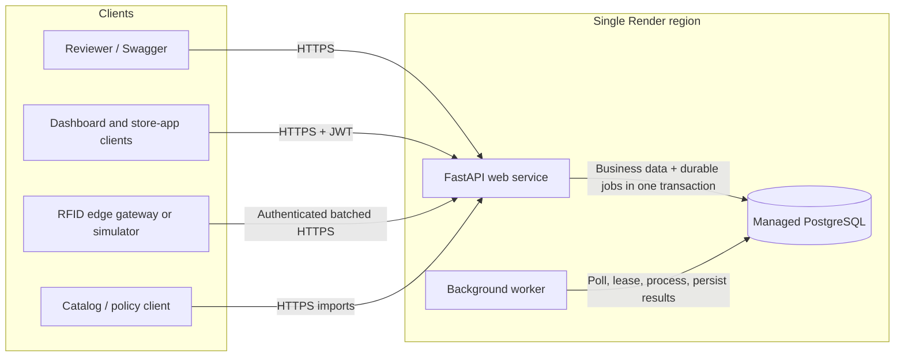
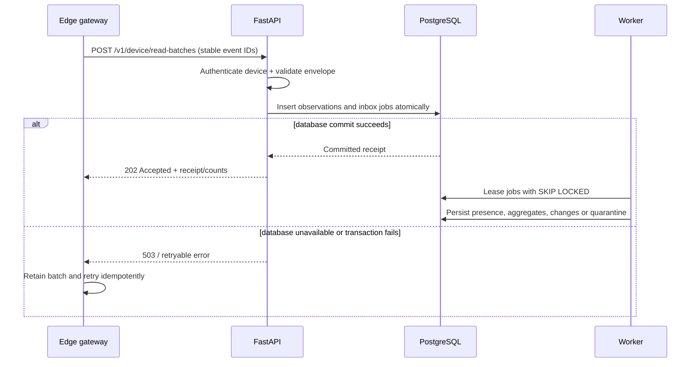
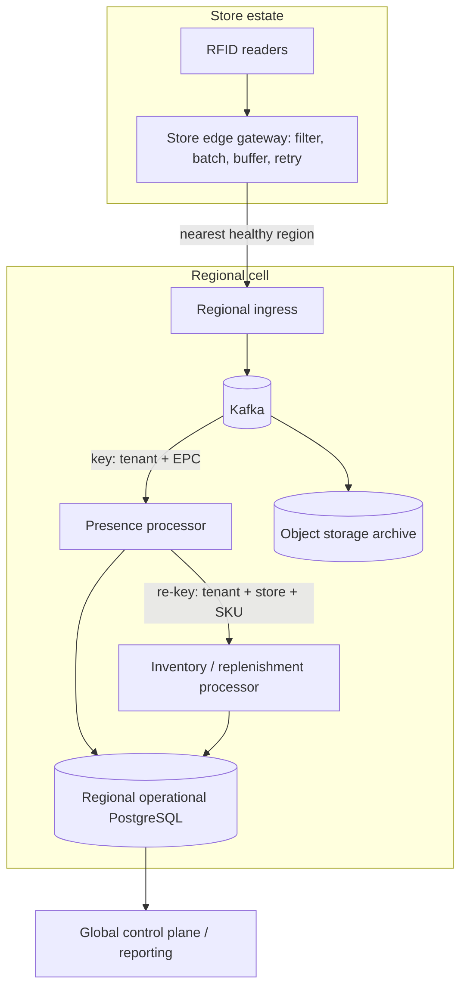

# Architecture Design

## Design goal

The solution provides a reviewable end-to-end path from Orange tenant/store setup through catalog and RFID ingestion to store-scoped access and explainable replenishment work. The submitted deployment topology favors durability and test reliability with few infrastructure dependencies. The production evolution adds streaming and regional isolation only when measured workload requires them.

The hosted topology and flows below describe the submitted code. The regional Kafka
topology, formal book-inventory variance, OIDC, RLS, metrics backend, and load targets
are explicitly production evolution and are not claimed as implemented or benchmarked.

## Hosted demonstration topology



### Why this topology

- The API and worker can scale and restart independently while sharing one codebase and domain model.
- PostgreSQL holds both accepted data and the durable work queue, so an accepted event does not depend on an in-memory handoff.
- Bounded polling trades a small amount of latency for a single durable correctness
  mechanism. `LISTEN/NOTIFY` is a possible wake-up optimization, not submitted code.
- A managed database, public web service and continuously running worker are simpler to keep alive for reviewer testing than a free trial plus an external broker.
- A live Kafka or SQS dependency is deliberately excluded from the hosted slice; it remains an evolution path, not a hidden requirement.

## Logical components

| Component | Responsibility | Persistence / boundary |
|---|---|---|
| Tenant onboarding | Create Orange as active, validate and atomically bulk-provision stores/zones | Tenant, store, zone and onboarding-batch records; staged lifecycle is future work |
| Hardware registry | Register reader devices, accept optional antenna-port evidence, and preserve effective-dated store/zone mappings | Device and mapping history |
| Catalog ingestion | Stage, validate, normalize, reconcile and promote product master data | Imports/errors, product-style records, SKU variants with UPC/color/size, attributes and EPC bindings |
| RFID ingress | Authenticate active-tenant devices, validate batch envelopes and durably accept observations | Retained raw event evidence plus inbox jobs in one transaction |
| RFID processor | Deduplicate effects, resolve historical mappings, handle noise/late data and update presence | Job leases, quarantine, item presence and inventory changes |
| Identity and access | Authenticate demo users and enforce role plus resource scope | Users, password hashes, roles, permissions and store grants |
| Replenishment | Manage effective-dated policies, calculate shortages and create idempotent work | Policies, rules, calculation evidence and tasks |
| Inventory projection | Expose confirmed observed floor/backroom state and `as_of` | Item presence, aggregates and auditable derived changes |
| Book variance (evolution) | Reconcile POS/receiving/transfer/return/shrink ledger with RFID evidence | Not implemented in the hosted slice |
| Operations | Health, readiness, identity audit, structured logs, migrations and release identity | Submitted operational controls; metrics/alerts are the production direction below |

The modules share a database initially, but communicate through explicit domain interfaces and durable jobs. That preserves transaction simplicity now and leaves seams for later service extraction.

## Data ownership and model

### Tenant, store and hardware

```text
Tenant
  -> Store
       -> Zone (for example, SALES_FLOOR or BACKROOM)
       -> DeviceAssignment [valid_from, valid_to)
            -> Device

RFIDObservation -> optional antenna_port evidence
```

Every tenant-owned row carries `tenant_id`. Store codes are unique within a tenant. Hardware mappings are effective-dated so an observation is attributed using the mapping valid at `observed_at`, even after a reader moves.

### Catalog

```text
CatalogImport -> StagedRow / ValidationError / ReconciliationSummary
ProductStyle (product/style attributes)
  -> SKU (variant attributes, color, size, UPC)
       -> EPCBinding [valid_from, valid_to)
```

Identifiers and relationships use constrained relational columns. Optional, source-specific attributes may use JSONB. Import records retain source checksum, mode, status, counts and error evidence. Promotion is separated from staging so invalid or conflicting source data does not partially corrupt the active catalog.

### RFID and inventory

```text
RFIDObservation (retained raw fields/payload; advancing processing metadata)
    -> InboxJob / Quarantine
    -> ItemPresence (current derived EPC state)
    -> InventoryChange (auditable derived transition)
    -> InventoryAggregate (tenant/store/zone/SKU view)

Future BookInventoryLedger (receipts, sales, transfers, returns, adjustments, shrink)
    -> Future variance workflow against observed quantity
```

Raw observations are not overwritten. Current presence and aggregates are derived views optimized for API reads. Book inventory remains separate because an RFID read does not itself prove a sale, receipt or shrink event.

### Identity and access

```text
User -> UserAccessGrant(role, optional store scope)
```

Roles express job capability; scopes express where it applies. Tenant and store authorization are derived from verified identity and persisted grants. A client cannot gain access by supplying another `tenant_id` or `store_id`.

### Replenishment

```text
ReplenishmentPolicy(scope, selector, effective period, priority, revision,
                    minimum, target, optional maximum)
Inventory + open work -> CalculationEvidence -> ReplenishmentTask
```

Policies are effective-dated and carry update timestamps plus a revision counter.
Evaluation lines snapshot the selected policy and thresholds, but full before/after
policy history is a production-hardening item. At most one active task is allowed per
tenant/store/SKU so repeated observations or recalculation retries do not create
duplicate work.

### Core invariants

- A store code is unique inside its tenant. Submitted API/worker writes validate
  tenant relationships; comprehensive composite tenant foreign keys and RLS remain a
  documented production-hardening gap.
- Hardware mappings for the same device cannot overlap in effective time.
- SKU and UPC identifiers are tenant-unique; EPC bindings are tenant-unique and
  non-overlapping in effective time. Exact source ownership/reuse rules remain an
  open Orange input.
- A client-generated UUID event ID is unique in its tenant; the stored payload
  fingerprint detects conflicting reuse across devices.
- Exactly one current item-presence row exists per tenant/EPC even though observation history is append-only.
- Aggregate inventory changes and the underlying presence transition commit together.
- At most one active replenishment task exists per tenant/store/SKU; completed task history is retained.
- Policy resolution must yield one deterministic rule or an explicit conflict, never an arbitrary winner.

## End-to-end data flows

### 1. Brand and store onboarding

1. A privileged operator submits Orange and a store batch with stable external keys and an idempotency key.
2. The API validates tenant uniqueness, store codes, hierarchy references, timezones, zone configuration and hardware identifiers.
3. Pydantic validation rejects a malformed batch before service execution. The
   submitted onboarding transaction is all-or-nothing, so it never leaves a partially
   provisioned 100-store batch.
4. Stores, standard zones and hardware mappings are created idempotently; an exact
   retry returns the original batch and a changed payload/key pairing conflicts.
5. Stores become active after the transaction succeeds. Rich external installation
   checklists and staged activation are production workflow extensions.

The design treats "environment provisioning" as configuration inside a shared SaaS deployment unless Orange requires dedicated infrastructure. That requirement is an open input, not an inferred fact.

### 2. Product master ingestion

1. A client creates an import with an explicit mode (full or incremental), source checksum and idempotency key.
2. Rows enter staging. Validation checks required fields, types, referential integrity, identifier format and uniqueness.
3. Normalization applies deterministic casing/whitespace/unit rules while retaining source values for evidence.
4. Reconciliation compares the staged rows with the active tenant catalog and reports created, updated, unchanged, rejected and conflicting rows.
5. Promotion applies an eligible result transactionally. `DELTA` never interprets
   omission as deletion; explicitly selecting `FULL` deactivates styles, SKUs and
   active EPC bindings omitted from that file.
6. Corrected mappings can trigger replay of quarantined RFID observations without
   rewriting their raw event fields/payload; assignment and resolution metadata may
   advance during replay.

### 3. Real-time RFID ingestion and processing



Processing rules:

- The UUID event ID is unique in its tenant. An exact retry is idempotent; the same ID with different content is a conflict requiring investigation.
- `observed_at` describes device time and `ingested_at` describes platform time. Mapping resolution uses the effective mapping at observation time.
- An older observation is retained but cannot regress a newer confirmed current state.
- A same-zone read refreshes evidence. A possible cross-zone move becomes a candidate until confirmation/hysteresis rules are met.
- A move requires consecutive reads within a configured confirmation window; missing
  reads do not prove absence.
- Inactive devices or devices under a suspended tenant are rejected during
  authentication. Unknown EPCs, missing effective assignments, timestamps beyond the
  configured future skew, queued work suspended before processing, and unsafe live
  EPC rebinds enter quarantine with a reason and replay/correction path.
- Reusing an event ID with different content returns a conflict disposition and does
  not create another observation.
- Initial presence trusts one structurally valid edge-filtered sighting. RSSI is
  retained, while initial-read confirmation and signal thresholds require Orange's
  measured reader/antenna characteristics.
- Worker retries are at least once. State transitions and aggregate changes use uniqueness/version checks so duplicate processing has one business effect.

### 4. Identity and store-scoped access

1. A demo user authenticates and receives a short-lived JWT containing identity, not caller-controlled authorization truth.
2. The API loads current role and resource grants and establishes tenant context.
3. Each endpoint checks the required operation and intersects requested store(s) with the persisted scope.
4. Corporate users may receive tenant-wide scope; managers and associates receive only explicitly granted stores and operations.
5. Denied cross-tenant or out-of-scope access returns an authorization error without revealing resource existence.

Production replaces local authentication with OIDC/SSO while retaining the same domain authorization checks.

Proposed permissions are granular even when bundled into reviewer-friendly defaults:

| Persona | Default scope | Proposed operations |
|---|---|---|
| Store associate | Explicitly assigned stores | Read inventory; read, claim and update replenishment tasks |
| Store manager | Explicitly assigned stores | Associate operations plus manage store task exceptions and store-scoped user assignments where permitted |
| Corporate user/admin | Explicit tenant-wide or selected-store scope | Cross-store inventory/reporting; optional user, catalog, policy and onboarding administration as separate permissions |
| Device principal | Its registered hardware identity | Submit RFID batches only; no interactive user APIs |

These are proposed defaults, not facts from the assignment. Separating operations such as `inventory:read`, `task:update`, `policy:write`, `catalog:write`, `user:manage` and `store:manage` avoids making every corporate user an administrator.

### 5. Policy ingestion and replenishment

1. A privileged user validates and creates a policy version with scope, selector, effective period, priority and quantity thresholds.
2. The resolver selects a single active rule by effective time, store-specific before tenant default, more specific selector before broader selector, and explicit priority. An unresolved tie is rejected rather than selected arbitrarily.
3. Confirmed RFID inventory changes enqueue targeted store/SKU recalculation. Policy
   changes use the explicit on-demand evaluation API in the submitted slice; scalable
   policy fan-out is future work. A shared tenant-policy advisory lock gives each
   multi-SKU evaluation a consistent rule snapshot while allowing evaluations to run
   together.
4. Under the provisional v1 rule, if `floor >= minimum`, the recommendation is zero. Otherwise:

   ```text
   need      = target - floor - open_task_quantity
   available = backroom - reserved_backroom
   move      = max(0, min(need, available))
   ```

5. The result stores the selected policy, inputs, inventory timestamp, formula and
   reason. A positive result creates or updates the one active task for that
   tenant/store/SKU. The full active quantity remains reserved after partial movement;
   verified work remains reserved until a later RFID aggregate transition reflects it.
6. The submitted provisional lifecycle is
   `OPEN -> CLAIMED -> IN_PROGRESS -> AWAITING_VERIFICATION -> VERIFIED`, with a
   cancellation path. The customer must confirm these semantics before production.

## Implemented REST surface

| Area | Representative endpoints | Notes |
|---|---|---|
| Authentication | `POST /v1/auth/login`, `GET /v1/auth/me` | Demo login; production direction is OIDC |
| Users/access | `POST/GET /v1/users`, `POST /v1/users/{id}:suspend`, audit listing | Corporate or assigned-store capability, scoped and audited |
| Onboarding | `/v1/platform/tenants`, `.../stores:bulk-onboard`, store/device listing | Platform-key integration plane and idempotent atomic batch |
| Hardware | `.../devices/{id}/assignments`, `.../credentials:rotate` | Effective-dated assignments and one-time key display |
| Catalog | `/v1/tenants/{tenant_id}/catalog/imports`, `/skus` | Staged status/errors and JWT SKU discovery |
| RFID | `POST /v1/device/read-batches`, platform observation list/replay | Device-authenticated acceptance and remediation |
| Inventory | `GET /v1/tenants/{tenant_id}/inventory` | Scoped, paginated aggregates with `as_of` |
| Policies | `/v1/tenants/{tenant_id}/replenishment/policies` and bulk import | Effective-dated management |
| Calculation/tasks | `/replenishment/evaluations`, `/replenishment/tasks` | Explainable scoped task lifecycle |
| Operations | `GET /health/live`, `GET /health/ready`, `GET /docs`, `GET /openapi.json` | Liveness is process-only; readiness checks dependencies |

Common API rules include idempotency keys for retriable commands, structured
validation/problem responses, timezone-aware timestamps, rejected unknown request
fields, and no user authorization based solely on a body/query tenant identifier.
High-growth catalog, user, observation, inventory, policy and task collections have
bounded `limit`/`offset`; the platform store/device/assignment lists still need
pagination for a large estate.

## Consistency and failure semantics

| Condition | Intended behavior |
|---|---|
| API restarts after an RFID batch was committed | Observations and jobs remain; the worker/poller resumes processing |
| Worker crashes while processing | Its lease expires; another worker retries; idempotent state changes prevent duplicate business effects |
| Poll cycle is delayed | The durable row remains pending; a later poll claims it |
| Database is unavailable before acceptance | Return a retryable error; do not claim `202 Accepted`; the edge retains and retries the batch |
| Exact duplicate event arrives | Return the prior/idempotent result and do not apply inventory twice |
| Same event ID carries different content | Return a conflict disposition; never insert another event or silently overwrite |
| Late event arrives | Retain it for audit; process only if it does not regress newer state |
| Noisy cross-zone observations arrive | Require consecutive confirmation within a bounded window |
| Unknown EPC or device mapping | Quarantine with reason; permit replay after catalog/mapping correction |
| One poison job repeatedly fails | Retry with bounded backoff, then quarantine/dead-letter it without blocking the partition/queue |
| Policy recalculation repeats | Upsert the one active task and account for open quantity |
| Deployment introduces a schema change | Run reviewed migrations and prefer backward-compatible expand/contract changes |

No component promises exactly-once delivery. The intended outcome is at-least-once processing with idempotent, auditable business effects.

## Capacity model and scale gates

Store count is not enough to size the system. Capacity testing must record at least:

- stores, readers and antennas;
- raw and post-edge-filter event rates;
- batch size and request rate;
- unique EPC cardinality and hot-key distribution;
- payload size, retention and replay window;
- number of independent consumers;
- p50/p95/p99 ingestion-to-query lag;
- database CPU/I/O, connection saturation, inbox depth and oldest-job age.

The submission includes functional database tests and a 100-store onboarding rehearsal,
not an RFID throughput benchmark. Before production acceptance, the test profile above
must be supplied and measured; neither 100 nor 5,000 stores alone proves that traffic
will fit.

### Evolution for approximately 100 stores

Retain the simple topology while measurement remains healthy:

1. Filter/coalesce redundant reads and batch at the edge.
2. Scale API and worker replicas independently; use connection pooling and bounded concurrency.
3. Partition high-volume observation/history tables by time and tenant/region as measurements require.
4. Archive old raw observation evidence to object storage if PostgreSQL retention becomes expensive.
5. Introduce Kafka when durable replay, sustained queue depth, multiple consumers, long offline catch-up or database write contention becomes material.

### Production direction for 5,000 stores



Each regional cell limits blast radius and data latency. Kafka provides partitioned ordering, replay and independent consumers. Ingestion keys by tenant plus EPC to serialize per-item state; derived inventory/replenishment work re-keys by tenant, store and SKU. The global plane manages tenant configuration and aggregated reporting, not every synchronous RFID state transition.

This is an evolution architecture, not a claim that the hosted PostgreSQL inbox is itself a 5,000-store solution.

## Security and tenant isolation

- TLS for all external connections and managed encryption at rest.
- Passwords stored only as adaptive hashes; secrets supplied through the hosting secret store.
- Short token lifetimes and no sensitive data in logs.
- Tenant-aware authorization and query paths. Composite tenant foreign keys and RLS
  are recommended defense in depth but are not submitted implementation.
- Device credentials bound to a tenant/device record; store and zone derived from effective mappings.
- Identity login/user changes have actor/time audit rows. Replenishment calculations
  snapshot policy inputs, but policy mutation audit history is a documented gap.
- Cross-tenant and unassigned-store tests are release blockers for every protected resource type.

## Operations and immutable-release safety

- Pin dependencies and build a repeatable container from the submitted commit/tag.
- Run migrations before traffic and take a managed backup before risky schema changes.
- Keep `/health/live` independent of dependencies; make `/health/ready` fail when the API cannot safely serve required operations.
- Emit submitted structured request logs with request IDs and structured worker logs
  with job/worker IDs while excluding secrets. Add tenant/device/import correlation
  and trace propagation as production hardening.
- Track request rate/error/latency, authentication denials, database saturation, inbox depth/age, worker retry/quarantine rate, RFID processing lag, catalog rejection rate and replenishment backlog.
- Alert on readiness failure, sustained oldest-job age, repeated poison jobs, database capacity and hosted endpoint unavailability.
- Apply edge/WAF login throttling for the submitted deployment; add a distributed
  limiter and bounded/aggregated failed-login audit retention for production.
- Deploy the exact tested version with automatic deploy disabled for submission; maintain stable demo credentials and data.
- Provide Docker Compose and deterministic input fixtures as a local fallback, and rehearse from a clean clone before submission.

## Explicit limits and non-claims

- The submitted worker polls the persisted inbox; it does not use `LISTEN/NOTIFY`.
- At-least-once delivery plus idempotency is not the same as exactly once.
- A radio read is time-stamped evidence, not unquestionable inventory truth.
- A missing read does not immediately establish item absence.
- Local password/JWT authentication is a reviewer-friendly demonstration, not the recommended enterprise identity system.
- The hosted topology is not claimed to support 5,000 stores without a measured workload and the regional streaming evolution.
- Near-real-time objectives are targets until load tests publish observed percentiles and test conditions.
- Free or trial hosting cannot guarantee availability for an immutable submission; even paid managed hosting reduces but cannot eliminate external outages.
- Receiving, transfers, returns, shrink, book inventory and variance are evolution
  designs, not implemented operational integrations.
